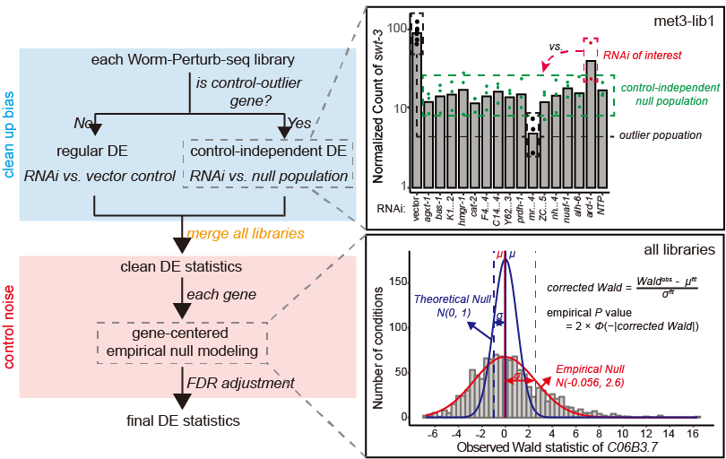

## EmpirDE: Empirical Null Based Differential Expression (DE) Analysis For Large-scale RNA-seq Data

------------------------------------------------------------------------
Please note that we are still actively developing this package. Please contact us if you see any issues!
------------------------------------------------------------------------

The R package **EmpirDE** is Differentially Expression (DE) analysis tool following the two-pronged DE analysis framework using empirical null,developed as part of the Worm Perturb-seq (WPS) technology. EmpirDE effectively identifies differentially expressed genes in large-scale transcriptomes dataset (i.e., > 100 conditions) by leveraging the many conditions profiled in parallel to rigorously control false discovery rate. Although this package was developed to support WPS data analysis, it is generally applicable to other similar large-scale transcriptomes data where many conditions are profiled together. The following illustration figure summarizes the two stages of EmpirDE framework:




For WPS users, following the <span style="color:blue"> [WPS computational analysis protocol](https://TBD) for seamless analysis.

To find out more details about **EmpirDE**, please read our manuscript:

[Title and authors](https://bioRxiv_link)

This introduction page provides a quick tutorial for running **EmpirDE** on standard WPS dataset or a custom dataset with many conditions. 

# Table of contents
1. [Installation](#installation-)
2. [Quick Start](#quick-start)
3. [Contact](#contact)
4. [Related Manuscripts](#related-manuscripts)


## Installation<a name="installation-"></a>

To install the development version from GitHub, please run:

``` r
if (!require("BiocManager", quietly = TRUE))
    install.packages("BiocManager")
BiocManager::install(version = "3.18")
if (!require("devtools", quietly = TRUE))
    install.packages("devtools")
devtools::install_github("XuhangLi/EmpirDE")
```

## Quick Start<a name="quick-start"></a>

The following code is a quick example of running the full **EmpirDE**. The function `EmpirDE()` takes in a count table that is a gene-by-sample dataframe of read counts of the input dataset and a metadata table that is a dataframe with required metadata (such as covariates) to run DE analysis. For more details, please check on the help page by `?EmpirDE`. For a test run:

``` r
data("countTable")
data("metaDataTable")
result <- EmpirDE(countTable, metaDataTable)
```

The required metadata of `EmpirDE()` includes the following columns:

- `sampleID`: unique IDs for each sample that correspond to the column names in countTable.
- `covTreatment`: covariate indicating experimental treatments to be tested for (e.g., RNAi conditions). Must have a 'control' condition if control-dependent DE analysis is deisred.
- `covBatch`: covariate indicating experimental batches, which by default is the replicate batch. Other reasonable batch labels within each library may also be used. 
- `libID`: unique IDs for identifying the sequencing library of each sample. EmpirDE analysis is first conducted at individual sequencing library level thus this ID is used to match samples pooled in the same library.

The output of `EmpirDE()` is a list tables for the DE results of each condition. Key columns include: 

-   `log2FoldChange_raw`: log2FoldChange from DESeq2. Adding the suffix '_raw' is to emphasize this metric is directly from DESeq2 model without applying any shrinkage algorithm.
-   `DE_source`: The DE result for this gene is based on which type of DE analysis, either control-dependent (vs. control) or independent (vs. control-independent null).
-   `empirical_pvalue`: Empirical p-values based on corrected test statistic. This is the final DE testing p-value of EmpirDE framework.
-   `FDR`: False Discovery Rate (FDR) of the DE test. This is the final DE testing FDR of EmpirDE framework.

It is notable that running full **EmpirDE** analysis on a real data set (e.g., 10,000 genes x 100 conditions x 3 replicates) can be time consuming. It is expected to see prolonged run time up to several hours. We are working on integrating parallelization functions to increase the performance.


For users interested in custom use of functionalities in **EmpirDE**, the following code gives a quick example on two common applications:


_To analyze the empirical null of a test statistic matrix, run_
``` r
data(example_stat_table)
result <- fit_empirical_null(example_stat_table)
```
The test statistic matrix can by obtained from a user-defined DESeq2 analysis of their own data (using the `stat` column from DESeq2 output). The `result` object includes the empirical p-value matrix calculated from the input test statistic matrix. 


_To perform control-independent DE analysis, run_
``` r
data(example_dds)
adaZmat <- fit_main_population(example_dds)
result <- control_independent_DE(example_dds, adaZmat)
```
The input `example_dds` is a DESeqDataSet objective that contains the input data. The DESeqDataSet should include specific covariate names, see details on the example data (`?example_dds`) for instructions. The returning object is a list of DE results for each conditions in the input DESeqDataSet.


## Contact<a name="contact"></a>

Any questions or suggestions on `EmpirDE` are welcomed! Please report it on [issues](https://github.com/XuhangLi/EmpirDE/issues), or contact Xuhang Li ([xuhang.li\@umassmed.edu](mailto:xuhang.li@umassmed.edu){.email}).

## Related Manuscripts<a name="related-manuscripts"></a>
-  **EmpirDE** integrates an algorithm (adaTiss) for robust fitting of the expression levels. See original paper at: 
    -   **adaTiss**: [Wang M, Jiang L, Snyder MP. AdaTiSS: a novel data-Adaptive robust method for identifying Tissue Specificity Scores. <em>Bioinformatics</em> (2021).]([https://www.nature.com/articles/s41587-023-01772-1](https://academic.oup.com/bioinformatics/article/37/23/4469/6306407))

## Acknowledgement
We thank Dongyuan Song for his help in building this package.

